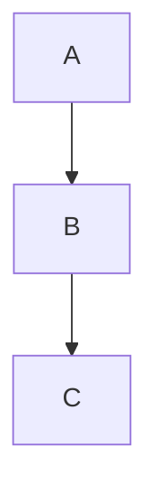

# 🛠️ Manual Básico de Herramientas para Computación

Este documento recopila herramientas que probablemente vas a utilizar durante la carrera o en proyectos personales.

---

# 📌 Índice

1. Git y GitHub
2. Entornos virtuales de Python
3. Docker
4. Herramientas para diagramas
5. Recursos recomendados

---

# 🌱 1. Git y GitHub

## ¿Qué es Git?

Git es un sistema de control de versiones que permite guardar el historial de un proyecto y trabajar en equipo.

## ¿Qué es GitHub?

GitHub es una plataforma para alojar repositorios Git en la nube.

---

## Instalación

### Linux (Ubuntu / Mint)

```bash
sudo apt update
sudo apt install git
```

### Verificar instalación

```bash
git --version
```

---

## Configuración inicial

```bash
git config --global user.name "Tu Nombre"
git config --global user.email "tu@email.com"
```

Ver configuración:

```bash
git config --list
```

---

## Crear un repositorio

```bash
mkdir proyecto
cd proyecto

git init
```

---

## Flujo básico

Ver estado

```bash
git status
```

Agregar archivos

```bash
git add .
```

Guardar cambios

```bash
git commit -m "Primer commit"
```

---

## Clonar un repositorio

```bash
git clone https://github.com/usuario/repositorio.git
```

---

## Subir cambios

```bash
git add .
git commit -m "Descripción"
git push
```

---

## Descargar cambios

```bash
git pull
```

---

## Comandos útiles

```bash
git log
git diff
git branch
git checkout
git switch
git merge
```

---

# 🐍 2. Entornos Virtuales de Python

## ¿Por qué usarlos?

Permiten instalar dependencias sin afectar el sistema operativo.

---

## Crear un entorno

Linux

```bash
python3 -m venv .venv
```

Windows

```powershell
python -m venv .venv
```

---

## Activarlo

Linux

```bash
source .venv/bin/activate
```

Windows

```powershell
.venv\Scripts\activate
```

---

## Instalar paquetes

```bash
pip install numpy
```

---

## Guardar dependencias

```bash
pip freeze > requirements.txt
```

---

## Instalarlas nuevamente

```bash
pip install -r requirements.txt
```

---

## Salir del entorno

```bash
deactivate
```

---

# 🐳 3. Docker

## ¿Qué es Docker?

Docker permite ejecutar aplicaciones dentro de contenedores aislados.

---

## Instalación

Ubuntu/Mint

```bash
sudo apt install docker.io
```

Agregar usuario al grupo

```bash
sudo usermod -aG docker $USER
```

Cerrar sesión y volver a entrar.

---

## Verificar

```bash
docker --version
```

---

## Ejecutar un contenedor

```bash
docker run hello-world
```

---

## Descargar una imagen

```bash
docker pull ubuntu
```

---

## Ver imágenes

```bash
docker images
```

---

## Ver contenedores

```bash
docker ps
```

Todos:

```bash
docker ps -a
```

---

## Ejecutar Ubuntu

```bash
docker run -it ubuntu bash
```

---

## Eliminar contenedor

```bash
docker rm ID_CONTENEDOR
```

---

## Eliminar imagen

```bash
docker rmi NOMBRE_IMAGEN
```

---

# 📐 4. Herramientas para Diagramas

## Excalidraw

Ideal para:

- bocetos rápidos
- arquitectura
- brainstorming
- diagramas simples

Ventajas

- Gratuito
- Online
- Muy intuitivo

---

## Draw.io (diagrams.net)

Ideal para

- UML
- ER
- Redes
- Diagramas profesionales

Ventajas

- Muy completo
- Compatible con Google Drive
- Compatible con GitHub

---

## Mermaid

Permite crear diagramas escribiendo texto.

Ejemplo



Muy útil para documentación en Markdown.

---

## PlantUML

Excelente para UML generado desde texto.

Muy usado en ingeniería de software.

---

# 📚 Recursos Recomendados

## Documentación Oficial

Git
https://git-scm.com/

Python
https://docs.python.org/

Docker
https://docs.docker.com/

Draw.io
https://www.diagrams.net/

Excalidraw
https://excalidraw.com/

Mermaid
https://mermaid.js.org/

PlantUML
https://plantuml.com/

---

# 💡 Recomendación

Aprender estas herramientas antes de empezar un proyecto ahorra muchísimo tiempo y evita problemas de organización y despliegue.
