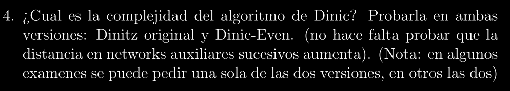

# SKELETON: Complejidad del Algoritmo de Dinitz ~ O(n²m)

## Descripción:
>Esta es una base estructurada del **Algoritmo de Dinitz** para poder entender su demostración.
El formalismo quedará en segundo plano ya que el objetivo es sentar bases y poder entender los
puntos a los cuáles queremos llegar.

## Observaciones:
> Notar que Penazzi nos dice explícitamente en la consigna las propiedades que podemos obviar para la
prueba de la complejidad del Algoritmo, por lo tanto esta base estructural vendrá de la mano con ello.

## Enunciado:


## Paso a Paso:
> El enunciado mismo nos dice que podemos utilizar el hecho de que las **distancias en networks auxiliares sucesivos aumenta** sin tener que probarlo nosotros mismos, y eso haremos.

### Preparación: Entendiendo la Complejidad - Ambas Versiones:
---

* Definiremos $n$ como **cantidad de nodos** y $m$ como **cantidad de lados** del Grafo en la Network.

* Sabemos que Dinitz trabaja en base a creación de NAs (Networks Auxiliares) sucesivas, en las cuáles se busca hallar un flujo bloqueante antes de pasar a otra network. Para generar una Network Auxiliar, Dinitz utiliza **BFS** que cuesta $O(m)$

* Asumiendo por enunciado que sabemos que las **distancias en NAs sucesivas aumentan** y que la máxima distancia finita en un Grafo de $n$ vértices es $n-1$, concluimos que puede haber un máximo de $O(n)$ Networks Auxiliares sucesivas (Es decir $O(n)$ iteraciones del Algoritmo de Dinitz, sin importar su versión)

* Luego para la búsqueda del flujo bloqueante, definiremos su complejidad como **CFB**

* Finalmente, la complejidad total del Algoritmo de Dinitz está determinada por:

    Complejidad(Construir NAs + CFB) = $O(O(n) * O(m + CFB))$

    (Si asumiéramos que **m $\le$ CFB**, entonces simplemente nos quedaría $O(n * CFB)$)

* Deberemos ver entonces que, sea **versión original** o **Dinitz-Even**: $CFB$ ~ $O(n*m)$

### CFB: Versión Original (Oriental) ~ O(n*m):

* Se garantiza que en cada NA, cada vértice con lado entrante tiene lado saliente, imposibilitando que exista la chance de **backtracking al hacer DFS** y buscar caminos aumentantes (Nos garantiza que por cada vértice que entremos, podamos salir, a la larga, esto nos induce a que llegamos a $t$ de alguna forma)

* Dicha condición de mantener al NA con esta propiedad la haremos mediante la operación **PODAR**

* Por lo tanto, la complejidad de hallar el flujo bloqueante CFB se divide en varias partes:
    * **Búsqueda de Caminos Aumentantes:**
        * Como no hay backtracking, hallar un camino $s$ ~ $t$ cuesta $O(n)$, pues recorremos $n$ niveles
        * Aumentar flujo y borrar lados saturados cuesta $O(n)$ (hay que recorrer nuevamente los caminos)
        * Como cada camino satura **al menos** un lado, entonces tenemos a lo sumo $O(m)$ caminos aumentantes en la NA
        * Por ende el subtotal queda como $O(n * m)$
    
    * **Recorrido de vértices con PODAR**
        * Sea PV la fase de hacer un **PODAR**, chequea si los vértices del camino tienen **lados salientes**
        * Cada ejecución de PV recorre los n niveles (n, n-1, ..., 0), osea cuesta $O(n)
        * Se ejecuta un PV por camino encontrado (y uno inicial), como hay m caminos ~ $O(m)$
        * Por ende el subtotal queda también como $O(n * m)$

    * **Borrado de lados y/o vértices**
        * Sea **B(x)** la operación de **borrar los lados de entrada a un vértice x que se quedó sin salida y el vértice x**
        * La complejidad es $O(d_{in}(x))$ (donde $d_{in}(x)$ es la cantidad de lados conectados como entrada al vértice x)
        * Como cada vértice se puede eliminar **a lo sumo una vez** en el flujo bloqueante, entonces nos queda un subtotal de:

            $\sum_{x \in V} O(d_{in}(x)) = O(m)$

    * **Total en CFB**
        * Tenemos finalmente que la complejidad del flujo bloqueante es:
        * $O(nm)$ + $O(nm)$ + $O(m)$ ~ $O(nm)$

### CFB: Versión Dinitz-Even (Occidental):

* Para esta versión, dado el siguiente pseudo-código:

```
    g=0
    STOPFLAG:=1                             // Para saber cuando parar
    WHILE (STOPFLAG)                        // While externo
        p = [s], x = s                      // Inicialización inicial de x y del camino p
        WHILE ((x != t) AND (STOPFLAG))     // While interno
            IF Γ+(x) != ∅ THEN AVANZAR(x)
                ELSE IF (x != s) THEN RETROCEDER(x)
                    ELSE STOPFLAG=0
        IF (x == t) THEN INCREMENTAR
    RETURN(g)
```

* Donde:
    * **AVANZAR(X):** Elegimos un vecino y en **Γ+(x)**, agregamos el lado xy al camino p, luego x = y, la precondición es que Γ+(x) **NO sea vacío**
    * **RETROCEDER(X):** Tomamos un vértice z anterior a x en la pila, borramos zx del camino p y network auxiliar, y actualizamos x = z
    * **INCREMENTAR:** Aquí dado el camino construido, calculamos cuanto flujo aumentamos, lo mandamos y borramos cualquier lado saturado del Network.


* Esta versión no utiliza **PODAR**, sino que, cuando hacemos **DFS**, al momento de aparecer un vértice conflictivo $x$ (un vértice que no tiene lados salientes), se realiza una operación **RETROCEDER(x)**
y borra el lado que generó dicho conflicto.

* Se analiza el coste según la cantidad de operaciones sobre el camino **p**:

    * **AVANZAR (A):** Agrega un vértice al camino **p** => es $O(1)$
    * **RETROCEDER (R):** Elimina un vértice del camino **p** y del Network el lado $zx$ que no lleva a $t$ => es $O(1)$
    * **INCREMENTAR (I):** Calcula el flujo dado el camino construido, aumenta el flujo y elimina lados saturados => es $O(n)$ (la longitud del camino es a lo sumo $n$)

* **Estructura de Secuencias:**
    * La ejecución del Algoritmo puede tener dos tipos de secuencias distintas en base a las operaciones dadas:
        * **A A A ... A R** (Encontró un vértice sin salida, tuvo que retornar y eliminarlo)

        * **A A A ... A I** (Tuvo éxito, llegó a $t$ e incrementó el flujo)

    * Como cada NA tiene a lo sumo $n$ niveles, entonces hay $O(n)$ As por secuencia:
         * **Coste 1ra secuencia: $O(n) * O(1) + O(1) = O(n)$**
         * **Coste 2da secuencia: $O(n) * O(1) + O(n) = O(n)$**
    
* **Cantidad de Secuencias:**
    * Cada operación **R** elimina exactamente un lado del NA
    * Cada operación **I** elimina **al menos** un lado saturado del NA

    * Hay $m$ lados en la red, por lo que puede haber un máximo de $O(m)$ secuencias que terminen en **R o I**

* **Complejidad total del CFB con Dinitz-Even:**
    * Complejidad(Cantidad de Secuencias * Costo de Secuencia)
    * $O(m) * O(n) = O(nm)$

### Conclusión:

* Como en ambas versiones tenemos la complejidad **CFB = O(nm)** entonces finalmente:

* Complejidad de Dinitz (ambas versiones): $O(n) * O(nm) = O(n²m)$

# Q.E.D (Quod Erat Demonstrandum)
 
