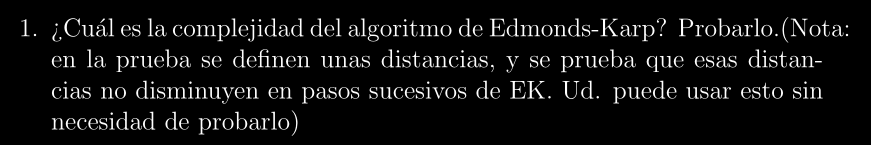

# SKELETON: Complejidad del Algoritmo de Edmonds-Karp ~ O(nm²)

## Descripción:
>Esta es una base estructurada del **Algoritmo de Edmonds-Karp** para poder entender su demostración.
El formalismo quedará en segundo plano ya que el objetivo es sentar bases y poder entender los
puntos a los cuáles queremos llegar.

## Observaciones:
> Notar que Penazzi nos dice explícitamente en la consigna las propiedades que podemos obviar para la
prueba de la complejidad del Algoritmo, por lo tanto esta base estructural vendrá de la mano con ello.

## Enunciado:

## Paso a Paso:
> El enunciado mismo nos dice que podemos utilizar el hecho de que las **distancias no disminuyen**
sin tener que probarlo nosotros mismos, y eso haremos. 
El otro detalle importante es que **DEBEMOS IDENTIFICAR Y MARCAR DONDE UTILIZAMOS UNA PROPIEDAD DE EDMONDS-KARP PARA GARANTIZAR QUE EL ALGORITMO TERMINE**, de lo contrario, el ejercicio estará **DESAPROBADO**, (puede confundirse con **Ford-Fulkerson**).

### Paso 0: Definición de las Distancias e Hipótesis:
---

Definiremos $n$ como **cantidad de nodos** y $m$ como **cantidad de lados** del Grafo.

**Distancia $d_k(x)$:** Longitud del camino aumentante mínimo (en cantidad de lados) desde la fuente $s$ hasta el vértice $x$ en el paso $k$.

**Monotonía (Lo que asumimos cierto):** Se asume sin probar que las distancias no disminuyen en pasos sucesivos, es decir: **$d_k(x) \le d_{k+1}(x)$**.

### Paso 1 - Distancias de vértices VECINOS:
---
Sea $xy$ lado de la **red residual**, definiremos y justificaremos que:

**$d_k(y) \le d_{k}(x) + 1$**

**Justificación:** 

Como $xy$ existe y es lado, en particular existe un camino **s ~ x -> y** cuya distancia en el paso $k$ desde el **source (s)** hasta **$y$** es efectivamente **$d_{k}(x) + 1$**,
como **$d_k(y)$** es la distancia del **CAMINO MÍNIMO ABSOLUTO** desde $s$ hasta $y$ implica que, por definición,
la distancia sea **menor o a lo sumo igual que $d_{k}(x) + 1$**. Por lo tanto se cumple.

### Paso 2 - Definición y complejidad de "LADO CRÍTICO":
---
**Definición:** Decimos que un lado $xy$ es **crítico** en el **paso $k$** si es el paso que hace que el
lado se **sature (o vacíe)** su capacidad y, por ende, **desaparece de la red residual en el paso $k + 1$**

**Objetivo:** Evaluar lo que ocurre con las distancias entre que un lado se vuelve crítico en un **paso k, desaparece y eventualmente vuelva a aparecer en un posterior paso "m"** en la red residual

#### 1. Paso k (xy es crítico):
> Aquí usaremos la propiedad de E.K que es **IMPORTANTÍSIMA destacar** en la prueba.

**Por la propiedad de E.K, el cuál utiliza BFS para hallar los caminos**, y el lado $xy$ pertenece al
camino, entonces tenemos que:

$d_k(y) = d_{k}(x) + 1$ **(VÁLIDO ÚNICAMENTE POR BFS)**

Luego el lado $xy$ desaparece en el paso $k+1$

#### 2. Paso intermedio l con k < l < m:
* Para que $xy$ vuelva a aparecer en la red residual, se debe **devolver flujo** en $xy$ (backward) es decir, el sentido opuesto $yx$

* **(NUEVAMENTE POR BFS del E.K):** tenemos entonces que para el lado opuesto $yx$: 

    $d_l(x) = d_{l}(y) + 1$.

* **Por Monotonía** y partiendo del paso intermedio $d_l(x)$ tenemos que:
    * $d_l(x) = d_{l}(y) + 1 \ge d_{k}(y) + 1 =  (d_{k}(x) + 1) + 1 = d_{k}(x) + 2.$
    * Implica que:  $d_l(x) \ge d_{k}(x) + 2$
    * Por **k < l < m** => $d_m(x) \ge d_{k}(x) + 2$

* Lo que nos dice que para que un lado $xy$ vuelva a ser crítico en un **paso posterior m**, la distancia
mínima tuvo que aumentar en **al menos dos unidades**

* Sabemos que la **distancia máxima** que puede tener un camino simple desde el **source (s)** hasta un vértice **x** en un grafo de **n vértices** es $n-1$, luego como además las distancias avanzan de 2 en 2,
y siempre aumentan tenemos que un lado se puede hacer crítico **$\frac{n-1}{2}$ ~ $\frac{n}{2}$ veces, medidos en términos de complejidad ~ $O(n)$**

* Como existen $m$ cantidad de lados y en la residual existen **lados fordward** y **lados backward**, entonces tendremos $2m$ lados totales, nos da una complejidad total de:  **$2m$ * $\frac{n}{2}$ = $nm$ ~ $O(nm)$** 

* Además, como para encontrar cada camino, Edmonds-Karp utiliza **BFS en el Grafo**, el orden es proporcional a sus lados, entonces a la complejidad anterior se la multiplica por **~ $O(m)$** (que es lo que cuesta BFS).

#### 3. Calculo Final:
Si juntamos los cálculos hechos hasta ahora, nos da una complejidad total de:
**$O(nm)$ * $O(m)$ ~ $O(nm²)$**

# Q.E.D (Quod Erat Demonstrandum)
 
