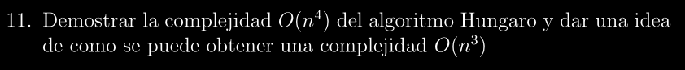
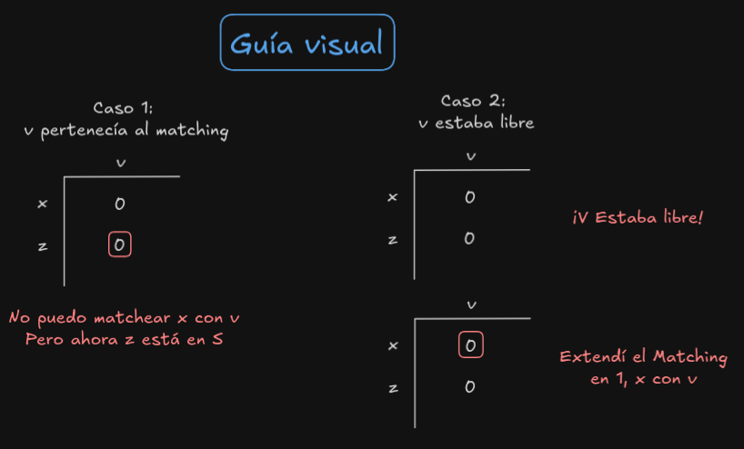

# SKELETON: Complejidad del Algoritmo Húngaro ~ O(n⁴) / O(n³) según versión

## Descripción:
>Esta es una base estructurada del **Algoritmo Húngaro** para poder entender su demostración.
El formalismo quedará en segundo plano ya que el objetivo es sentar bases y poder entender los
puntos a los cuáles queremos llegar.

## Enunciado:

### Paso 0 - Planteamiento:
---

* Definimos $n$ como **cantidad de nodos** y la Matriz asociada al Matching será **$n$ x $n$**

* La forma dada en clase es correr E.K sobre la Matriz, obligatoriamente no podemos cambiar ningún network auxiliar al cambiar la matriz, y en dichos cambios, si bien podemos "perder 0s", lo que nos garantizamos es que ningún "0" del Matching parcial se va a perder.

* La idea es evaluar cuánto cuesta primero la "preparación" antes del algoritmo:
    * Restar mínimo $m$ en cada fila y columna
    * Primer Matching de 0s
    * Costo de lados agregados al Matching

* Para luego calcular **POR EXTENSIÓN DEL MATCHING**:
    * Costo de **extender Matching en UN LADO**
    * Costo de UN **CAMBIO DE MATRIZ**
    * Por **CUANTOS CAMBIOS requeridos**

* Esto dependiendo el método que utilicemos, nos puede dar complejidad **$O(n⁴)$ u $O(n³)$**

### Paso 1 - Costos Iniciales ~ O(n²):
---
>Aquí tenemos 3 partes, la de **restar minimo en cada fila / columna**, el **primer matching de 0s** y **Costo de extender el matching parcial**

#### Restar mínimo en cada fila y columna de la Matriz ~ O(n²)
* Restar el mínimo de una fila implica recorrer sus $n$ elementos, luego para las $n$ filas de la matriz cuesta ~ $O(n²)$, análogo para las columnas ~ $O(n²)$

**SubTotal:** **$O(n²)$ + $O(n²)$ ~ $O(n²)$**

#### Primer Matching de 0s ~ O(n²)
* Buscar los ceros principales para el primer matching implica recorrer uno a uno los **$n$ x $n$ coeficientes de la matriz ~ $O(n²)$**

#### Lados agregados al Matching ~ O(n)
* Como en cada cambio de matriz no perdemos el matching parcial que vamos obteniendo, nos fijamos siempre en columnas donde hay "nuevos 0s" para poder extender dicho matching, por cada ejecución de E.K extendemos en **A LO SUMO UN LADO el Matching** luego como tenemos $n$ lados en un matching perfecto, la complejidad queda como **~ $O(n)$**

**Total del Paso 1 ~ $O(n²)$ + $O(n)$ x (complejidad de extender UN LADO)** 

### Paso 2 - Costo extender Matching en UN lado ~ O(n²)
---

Revisar las columnas, si uno construye bien la estructura de datos, será $O(1)$ pues al revisar la columna sólo queremos ver si esta “libre ”o no, y si no está libre, cuál es la fila matcheada con
esa columna, pero obviamente esto lo podemos tener guardado de forma tal que revisarlo sea $O(1)$

Cada vez que etiquetamos a una fila (lo cuál se puede hacer una sola vez por etapa) se deben revisar sus $n$ vecinos (columnas) en busca de 0s que puedan extender el matching, luego como existen $n$ filas entonces la complejidad total que obtenemos es de **$n$ x $O(n)$ ~ $O(n²)$** (Donde $O(n)$ proviene de revisar las columnas en búsqueda de lados para extender el matching).

**Observación**: Si dependiera solo exclusivamente de estos pasos, la complejidad nos quedaría como:

$O(n²) + O(n)$ x $O(n²) = O(n³)$

Sin embargo, nos falta el cambio de matriz

$O(n²) + O(n)$ x [$O(n²) + $ **(cambio de matriz)**]

### Paso 3 - Costo Cambio de Matriz ~ O(n³)
---
* Definiremos $CM$ como el **costo de cambiar una vez la matriz** y $T$ como las **veces que cambiamos la matriz** el objetivo será calcular ambos por separado

#### Cálculo de CM ~ O(n²)
Para cambiar la matriz requerimos:
* Calcular $m$
    * Requiere calcular el mínimo de los elementos en: **$S$ × $Γ⁻⁻(S)$ (gamma S barra/complemento)** asi que es $O(n²)$
* Restar $m$ de $S$ y sumarlo a $Γ(S)$
    * Por cada fila $\implies$ actualizar todos los elementos, la complejidad es $O(n)$
    * Por lo tanto restar m en las filas de $S$ es $O(n)$ x |$S$| = $O(n²)$
    * De forma análoga a sumar en $Γ(S)$ es $O(n²)$

**Total:** es **$O(n²) + O(n²) = O(n²)$**

#### Cálculo de T ~ O(n)
Aquí usaremos que **depende totalmente de que el matching parcial se mantiene en cada CM**, luego usaremos la siguiente propiedad clave:

>Luego de un cambio de matriz, o **crece el matching o crece el $S$**

Implica que deberemos probar que:

>Supongamos que el algoritmo de extensión de matching de ceros en una matriz C se detiene al encontrar un S con |S| > |Γ(S)| y que cambiamos la matriz restando m = min{Cx,v : x ∈ S, v ∈ Γ⁻⁻(S)} de las filas de S y sumando m a Γ(S), y luego continuamos la busqueda desde donde la habiamos dejado. Entonces, con la nueva matriz obtenida, o bien al correr el algoritmo se agrega un nuevo lado al matching, o bien se detiene con un Snuevo con |Snuevo | > |Γ(Snuevo )| tal que **|Snuevo | > |S|**.

**Explicación antes de probarla: (Es una mierda esta propiedad)**

* Nosotros estamos en una matriz dada, nos detenemos porque no podemos extender el matching, es decir **|$S$| > |$Γ(S)$|**

* Cambiamos la matriz restando m en $S$ y sumando m en $Γ(S)$, haciendo que aparezcan más 0s y poder evaluar la opción de extender el matching

* Con esta nueva matriz, volvemos a correr E.K, ahora esos nuevos 0s conectan una fila de $S$ con una columna ajena a $Γ(S)$ (osea gamma(S) barra) y avanzamos hacia esa columna y podemos tener 2 situaciones:
    * Si la columna estaba libre, entonces podemos extender el matching, y se termina esa etapa

    * Si la columna NO estaba libre, la fila linkeada a dicha columna se agrega al $S$, haciendo que ahora tengamos un $Snuevo$ con tamaño más grande, y el algoritmo continuará buscando otros caminos hasta que se quede sin 0s

    * Como hay $n$ filas, el proceso de agregar filas al $S$ NO puede ser infinito, eventualmente deberá terminar y poder extender el Matching

**Prueba:**
* Sea $x$ en $S$ y v en $Γ⁻⁻(S)$ tal que m = Cx,v 

* Al restar $m$ de $S$ en la nueva matriz, tendremos un nuevo cero en la posición Cx,v

* Como x está en $S$, al continuar el algoritmo (en términos de la matriz), etiquetará a $v$
(antes no podía pues Cx,v > 0 y sabemos que no está etiquetada porque v no estaba en $Γ(S)$)

* Ahora se pueden abrir 2 escenarios posibles:
    * **v NO formaba parte del matching** (pues al revisar la columna, no hay ningun 0 marcado), entonces logramos encontrar una nueva pareja, por ende, extender el matching (x matcheado con v), entonces en una siguiente iteración, si etiquetamos una fila x' con v, x' va a ver que v es pareja de x. **Resultado: Logramos extender el matching** 

    * **v ya formaba parte del matching** (tenía un 0 indicado en alguna posición de la columna), entonces significaba que tenía una fila z asociada (con la cuál está marcado el 0), implica que v es vecino de z, y como v no estaba en $Γ(S)$ entonces z no estaba en $S$, luego v etiqueta a z (en términos de la matriz), y por ende agregamos z al $Snuevo$, si luego de agregar a z, pudimos extender el matching, mismo resultado que arriba, sino, mínimamente tenemos un elemento más en $S$, el z, entonces |$Snuevo$| > |$S$| 

Ejemplo visual para intentar entender la diferencia:

**Fin Prueba**

* Como hay solo $n$ filas, el procedimiento de |$Snuevo$| > |$S$| se puede hacer un máximo de $n$ veces antes de obligatoriamente encontrar una columna libre, por lo que, por la Propiedad de arriba, $T \le n \implies$ $T$ es $O(n)$

### Paso 4 - Cálculos finales

Como vimos que:

$O(n²) + O(n)$ x [$O(n²)$ + (cambio de matriz)] 

$O(n²) + O(n)$ x [$O(n²)$ + ($CM$ x $T$)] 

$O(n²) + O(n)$ x [$O(n²)$ + ($O(n²)$ x $O(n)$)] 

$O(n²) + O(n³)$ + $O(n⁴)$ ~ $O(n⁴)$

## Complejidad O(n³) - Costo Cambio de Matriz ~ O(n²) (O(CM) = O(n)) (versión optimizada)

>El objetivo que tiene esta "optimización" es poder bajar el costo de cada $CM$ (Cambio de Matriz) de **$O(n²)$ a $O(n)$**

**Justificación:**
Ya vimos que inicialmente tenemos que:

$O(n²) + O(n)$ x [$O(n²)$ + ($CM$ x $T$)] 

= $O(n²) + O(n)$ x $O(n²)$ + $O(n)$ x ($O(CM)$ x $O(T)$)

= $O(n²) + O(n³)$ + $O(n)$ x ($O(CM)$ x $O(n)$)

= $O(n³)$ + $O(n²)$ x $O(CM)$

Luego, para que toda la complejidad de Húngaro sea O(n³), obligatoriamente necesitamos que:

$O(CM)$ = $O(n)$

### Logrando que O(CM) tenga costo lineal
---

Recordemos que para hacer un CM necesitamos hacer dos cosas:

1. Calcular $m$

2. Restar/Sumar $m$ en $S$ y $Γ(S)$ respectivamente

#### ¿Cómo calcular m en O(n)?
Sabiendo que **m = min{Cx,v | x $\in$ S, v $\in$ $\overline{\Gamma(S)}$}** 

Deberemos usar el truco de que **mínimo de minimos ES MÍNIMO**

Definiremos un array **mS[v] = min{Cx,v | x $\in$ S}** donde **mS[v]** nos indica el **mínimo de elementos de la columna v que están en filas de S**

Entonces redefiniendo m como:

**m = min{min({Cx,v | x $\in$ S}) | v $\in$ $\overline{\Gamma(S)}$}**

y usando la definición de **mS[v]** nos queda que:

**m = min{mS[v] | v $\in$ $\overline{\Gamma(S)}$}**

De esta forma (asumiendo que conocemos los mS[v]) podemos calcular m en $O(n)$ pero, ¿Qué ocurre con el cálculo de mS[v]? Sigue siendo **$O(n²)$**

#### Calculando mS eficientemente
La idea no es sumar más complejidad al Algoritmo, por lo que el "Truco" aquí será aprovechar otra instancia del Algoritmo cuya complejidad ya conocemos que es $O(n²)$ y allí sumar el cálculo del **mS**

Esta instancia no es otra que la de fijarse en **vecinos de las filas agregada a S**, al momento de buscar vecinos para intentar extender el matching, recorremos las filas en busca de 0s, por cada fila recorrer sus elementos cuesta $O(n)$ como podríamos llegar a tener $n$ filas en este proceso, entonces el proceso general cuesta $O(n²)$, además si el elemento que estamos viendo no es 0, estaríamos "perdiendo tiempo", el cuál podemos aprovechar para ir calculando o actualizando el **mS**

Seguimos entonces, en dicha instancia estos pasos:

* Inicializar **mS** con elementos muy grandes

* Por cada fila x $\in$ S revisamos:
    * Debemos ver si $Cx,v$ es 0 para encontrar vecinos
    * En simultáneo comparamos $Cx,v$ con $mS[v]$
    * if $Cx,v < mS[v]$, entonces actualizamos mS[v]
    * Esta actualización es $O(1)$ y nos mantiene siempre con el mínimo elemento

* Habremos aprovechado en una sola instancia $O(n²)$ buscar **vecinos de las filas agregadas a S** y **actualizar/calcular mS**, dejando el cálculo de m en $O(n)$

**Observación:** 

Gracias al **mS[v]** podemos saber instantáneamente cuales v $\in$ $\Gamma(S)$ y cuáles v $\in$ $\overline{\Gamma(S)}$, como los $\Gamma(S)$ son **VECINOS** de $S$, es decir, las columnas que tienen un 0 en alguna fila de $S$, entonces podemos decir directamente que:

**v $\in$ $\overline{\Gamma(S)}$ si y solo si mS[v] $\ne$ 0**, luego:

**m = min{mS[v] | v $\in$ $\overline{\Gamma(S)}$}** 

= **m = min{mS[v] | mS[v] $\ne$ 0}**

#### ¿Cómo restar/sumar m en O(n)?
El secreto está en dejar de restar/sumar m por elemento y empezar a hacerlo por **fila/columna en abstracto**, ¿Cómo? mediante arrays nuevamente.

Sea RF[x] array que indica cuánto hay que restarle a la fila x y SC[v] array que indica cuánto hay que sumarle a la columna v, en vez de cambiar todos los elementos, simplemente actualizaremos los arrays, lo que cuesta $O(n)$

**Aun así y con los arrays actualizados, ¿Y para hacer el cálculo?**
Si la matriz no se actualiza, no aparecen 0s, entonces no podemos buscar extender el matching.

Para ello, haremos lo siguiente:

* En vez de buscar 0s de la forma: **C[x][v] == 0**
* Buscaremos **C[x][v] - RF[x] + SC[v] == 0**

En general lo que hacemos es:
* Calcular **temp = C[x][v] - RF[X] + SC[v]**
* Y luego usar dicho temp para comparar y actualizar el mS[v]

Con estos trucos, logramos obtener un CM en $O(n)$, luego:

= $O(n³)$ + $O(n²)$ x $O(CM)$

= $O(n³)$ + $O(n²)$ x $O(n)$

= $O(n³)$ + $O(n³)$ = $O(n³)$

# Q.E.D (Quod Erat Desmontradum)
