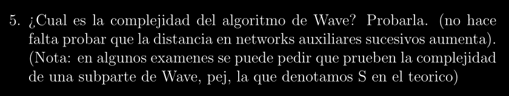

# SKELETON: Complejidad del Algoritmo Wave de Tarjan ~ O(n³)

## Descripción:
>Esta es una base estructurada del **Algoritmo Wave de Tarjan** para poder entender su demostración.
El formalismo quedará en segundo plano ya que el objetivo es sentar bases y poder entender los
puntos a los cuáles queremos llegar.

## Observaciones:
> Notar que Penazzi nos dice explícitamente en la consigna las propiedades que podemos obviar para la
prueba de la complejidad del Algoritmo, por lo tanto esta base estructural vendrá de la mano con ello.

## Enunciado:

## Paso a Paso:
> El enunciado mismo nos dice que podemos utilizar el hecho de que las **distancias en networks auxiliares sucesivos aumenta**
sin tener que probarlo nosotros mismos, y eso haremos. 

>El otro detalle importante es que **Dividiremos la prueba en BLOQUES, pues como se aprecia en la consigna, nos dice que en algunos exámenes nos pueden tomar nomas una parte del Algoritmo, es recomendable seguir esta estrategia para tener los bloques bien identificados**

### Paso 0 - Planteamiento:
---

* Definimos $n$ como **cantidad de nodos** y $m$ como **cantidad de lados**

* El Algoritmo de Wave avanza en **Networks Auxiliares sucesivos** (por la hipótesis de Dinitz)

* Asumiendo que las distancias en networks auxiliares sucesivos **siempre aumenta**, entonces podremos tener como máximo $n$ networks auxiliares sucesivos

* Por ende para medir la complejidad total de Wave tendremos que:
    * Arrancamos con un total máximo de **~ $O(n)$** por la cantidad de Networks Auxiliares
    * Y nos focalizaremos en el costo de hallar un **Flujo Bloqueante** en **UN SOLO NETWORK AUXILIAR**.
    * Esto quiere decir que deberemos probar que dicho costo es **~ $O(n²)$**.

### Paso 1 - Estrategia de Costo Auxiliar:
---
>Una vez definido nuestro objetivo **Saber cuanto cuesta un Flujo Bloqueante en un Network Auxiliar**, pasaremos a dividir la complejidad en varios grupos

>Estos grupos son **Las subpartes de las cuáles nos habla Penazzi**

**Definición del "Costo":** Lo que nos interesa saber a nosotros es la cantidad de veces que se debe procesar o revisar un lado, tanto en **Fordward Balance $FB(x)$** y **Backward Balance $BB(x)$** dado un nodo $x$. Y aquí es donde surgen **4 categorías** dependiendo, la **dirección de la Ola y el resultado en ese lado**, es decir:

* **Subparte S:** Serán los **Lados que se Saturan en un $FB(x)$ -> Ola hacia adelante**

* **Subparte FP (P):** Serán los **Lados que Permanecen en un $FB(x)$ -> Ola hacia adelante**

* **Subparte V:** Serán los **Lados que se Vacían en un $BB(x)$ -> Ola hacia atrás**

* **Subparte BP (Q):** Serán los **Lados que se Quedan con flujo en un $BB(x)$ -> Ola hacia atrás**

>**OBS:** Puse FP = P | BP = Q, puesto que, al parecer Penazzi utiliza FP y BP para identificar las partes

Averiguando la complejidad de cada Subparte obtendremos el **costo del Flujo Bloqueante**, entonces:

**$S + FP + V + BP$ ~ $O(n²)$**

### Paso 2 - Calculando las complejidades de las Subpartes:
---

### Subpartes S (Satura) y V (Vacía) ~ O(m):
* "Se destruyen o limpian".

* **Argumento:** * Cuando un lado se satura en un $FB(x)$, el vecino se elimina de $\Gamma^+(x)$. Como los conjuntos $\Gamma^+$ nunca recuperan miembros dentro del mismo network auxiliar, un lado solo puede saturarse una vez.

* **Análogo para $V$:** un lado solo se vacía por completo una vez en un $BB(x)$.

**Resultado:** $S \le m \implies O(m)$ y $V \le m \implies O(m)$.

### Subparte FP (Permanece - NO se satura) ~ O(n²):
* Si un lado al pasar por $FB(x)$ NO se satura es porque el flujo remanente en $x$ se acabó ($D(x) = 0$), lo que hace **detener inmediatamente** el $FB(x) \implies$ existe **A LO SUMO 1 LADO TIPO P** en cada llamada a $FB(x)$.

* En cada **ola hacia adelante**, los vértices internos se procesan **A LO SUMO UNA VEZ**, por lo que hay un máximo de $n-2$ llamadas a FB. (Se descartan **el source y sink**).

* En cada ola hacia adelante **(SALVO LA ÚLTIMA)**, **al menos un** vértice se BLOQUEA, por lo que podremos tener un máximo de **$n$ olas**

* Finalmente, la complejidad de la subparte de P estará dada por:
    * **Cantidad de Llamadas x Cantidad de Olas**

    * Es decir **$O(n)$ x $O(n)$ ~ $O(n²)$**

### Subparte BP (Queda Flujo - NO se vacía) ~ O(n²):
* Exactamente 'dual' a P, si un lado al pasar por $BB(x)$ NO se vacía es porque **x al hacer $BB(x)$ "se saldó la deuda", es decir, hubo un nodo en $M(x)$ que le vació el flujo de más a x**

* Por dualidad de P, hay un máximo de $n-2$ llamadas a BB y hay **$n$ olas**, pues por cada Ola hacia adelante existe una Ola hacia atrás **(SALVO LA ÚLTIMA)**.

* Finalmente, la complejidad de la subparte Q estará dada por:
    * **Cantidad de Llamadas x Cantidad de Olas**

    * Es decir **$O(n)$ x $O(n)$ ~ $O(n²)$**

### Paso 3 - SUMA y CÁLCULO FINAL:
---
Dadas las complejidades de S, P, V, Q tenemos que la complejidad final de hallar un Flujo Bloqueante en la Network Auxiliar es de:

**$O(m) + O(n²) + O(m) + O(n²)$ ~ $O(n²)$**

Como habiamos dicho que **Pueden existir A LO SUMO $n$ Networks Auxiliares Sucesivas** entonces, nos queda que la complejidad del Algoritmo Wave es:

**$O(n)$ x $O(n²)$ ~ $O(n³)$**

# Q.E.D (Quod Erat Demonstrandum)