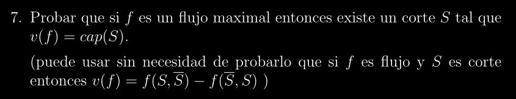

# MAX FLOW - MIN CUT Ida | Demostración

## Descripción:
>Esta es la demostración formal del Teorema **Max Flow - Min Cut Ida** dado en la cátedra

## Observaciones:
> Notar que Penazzi nos dice explícitamente en la consigna las propiedades que podemos obviar para la
prueba del teorema, por lo tanto esta demostración vendrá de la mano con ello.

## Enunciado:

## Paso a Paso:
> El enunciado mismo nos dice que podemos utilizar el hecho de que: **$v(f) = f(S, \overline{S}) - f(\overline{S}, S)$**
sin tener que probarlo nosotros mismos, y eso haremos. 

### Paso 0: Definición de los bloques a probar:
---
Es solo un fragmento del Max Flow - Min Cut el cuál nos dice que:

**f es flujo maximal y S es un corte minimal SI Y SOLO SI $v(f) = CAP(S)$**

**Ida ($\Rightarrow$):** Si $f$ es flujo maximal, existe un corte $S$ tal que $v(f) = CAP(S)$

**Prueba:**

* Hipótesis: $f$ es flujo maximal

* Construiremos el conjunto $S$ (corte) de forma tal que se cumpla la **tésis**

* Definiremos entonces $S$ como:

    * **$S$ = {$s$} U {x | $\exist$ camino aumentante de $s$ a $x$}**, donde s es la fuente
* **Probar que S es un Corte**:
    * Supongamos que S no fuera un Corte, como $s \in S$ por definición de $S$, la única forma de que $S$ **NO sea corte** es que $t \in S$, (donde $t$ es el sumidero)
    * Si $t \in S$ $\Rightarrow$ existe un $f$-camino aumentante de $s$ a $t$ $\Rightarrow$ **podríamos aumentar el flujo**, pero es absurdo porque partimos de que $f$ es **flujo maximal** $\Rightarrow$ $t \notin S$
    * Entonces, **$S$ es Corte**
* **Probar que $v(f) = CAP(S)$**:
    * **Caso 1 (Lados fordward)**, Sean $x \in S$ e $y \notin S$, con $xy \in E$. Como $x \in S$ entonces hay un camino aumentante de $s$ a $x$; Como $y \notin S$ entonces NO hay un camino aumentante de $s$ a $y$. Para que no se pueda extender el camino a $y$, el lado debe estar saturado $f(xy) = c(xy)$, implicando que:
     $$f(S, \bar{S}) = \sum_{\substack{x \in S, y \notin S \\ \vec{xy} \in E}} f(\vec{xy}) = \sum_{\substack{x \in S, y \notin S \\ \vec{xy} \in E}} c(\vec{xy}) = c(S, \bar{S}) = CAP(S)$$
    
    * **Caso 2 (Lados backward)**: Sean $x \notin S$ e $y \in S$, con $xy \in E$. Como $x \notin S$ entonces NO hay camino aumentante de $s$ a $x$; Como $y \in S$, entonces HAY camino aumentante de $s$ a $y$. Para que no se pueda dar un paso hacia atrás a $x$, el lado debe estar vacío $f(xy) = 0$, implicando que:
    $$f(\bar{S}, S) = \sum_{\substack{x \notin S, y \in S \\ \vec{xy} \in E}} f(\vec{xy}) = \sum 0 = 0$$

* **Conclusión**: Usando que 

$v(f) = f(S, \overline{S}) - f(\overline{S}, S)$

Reemplazamos:

$v(f) = CAP(S) - 0$

**$v(f) = CAP(S)$**

# Q.E.D (Quod Erat Demonstrandum)
 
